# Discussion: Comparing Odometry and SLAM Methods

## Overview

Four localization methods were evaluated across three sequences recorded on a TurtleBot3 Burger in indoor hallway environments. SLAM (slam_toolbox with loop closure) is treated as the best available reference since it uses graph-based optimization.

| Sequence | Environment | Key Challenge |
|----------|-------------|---------------|
| 00 | Empty hallway, no obstacles | Featureless walls  |
| 01 | Obstacles with sharp turns | Rapid heading changes stress IMU fusion |
| 02 | Obstacles with smooth motion | Longer trajectory, tests drift accumulation |

---

## Accuracy (Position Error vs SLAM)

| Method | Seq 00 Mean (m) | Seq 01 Mean (m) | Seq 02 Mean (m) |
|--------|----------------|----------------|----------------|
| Wheel  | 3.560          | 2.720          | 2.780          |
| EKF    | 2.930          | 0.640          | 2.620          |
| ICP    | 0.990          | 0.990          | 1.170          |

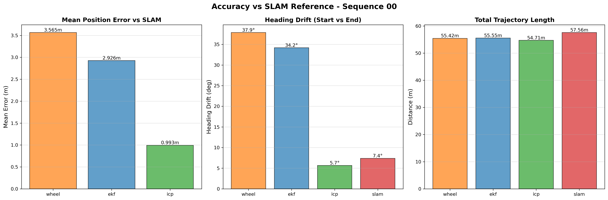
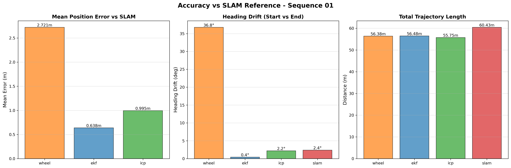
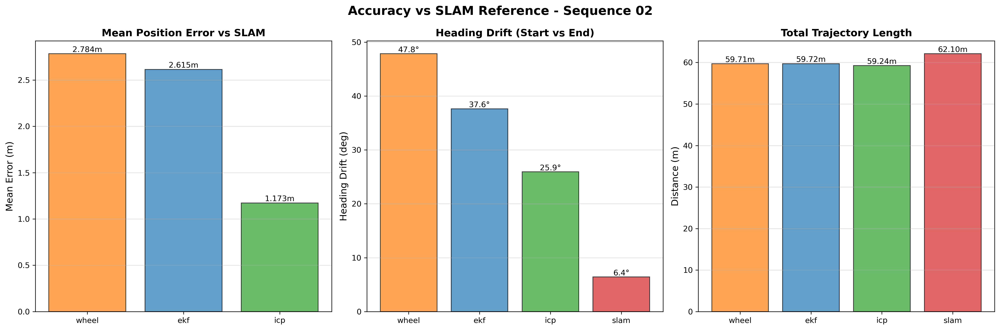

**Observations:**

- **ICP is the most consistently accurate** method across all three sequences, with mean error vs SLAM staying around 1.0m. The LiDAR scan matching provides absolute position corrections that prevent drift from accumulating.

- **EKF shows variable performance.** In Sequence 01 (sharp turns), the EKF achieves the best accuracy (0.64m) because the IMU heading corrections are most beneficial during rapid rotations. However, in Sequences 00 and 02, the EKF provides only a modest improvement over wheel odometry because the dominant error source is translational drift, which the IMU cannot correct.

- **Wheel odometry has the highest error** in all sequences (2.7-3.6m mean), as expected. Without any external correction, errors from wheel slip and integration accumulate continuously.

---

## Drift Analysis

Drift is the accumulated position error over time. The following shows how error grows throughout each trajectory:

### Sequence 00 (Empty Hallway)

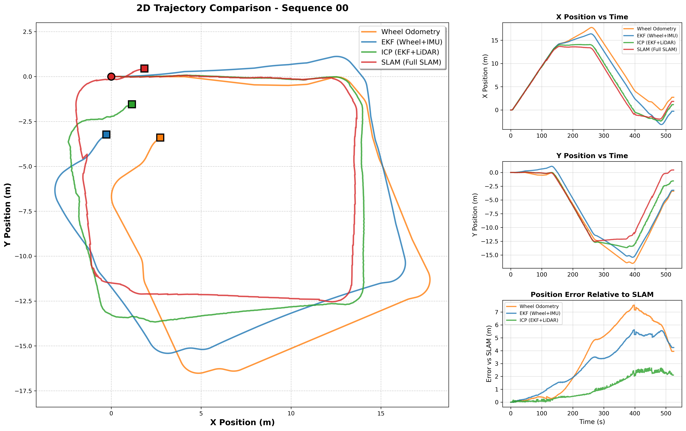

In the featureless environment, wheel odometry drifts steadily due to heading error from encoder noise. The EKF reduces heading drift via IMU fusion but cannot correct translational errors. ICP provides the strongest drift correction by matching laser scans against the local map, keeping the trajectory close to the SLAM reference even in the relatively featureless hallway.

### Sequence 01 (Sharp Turns)

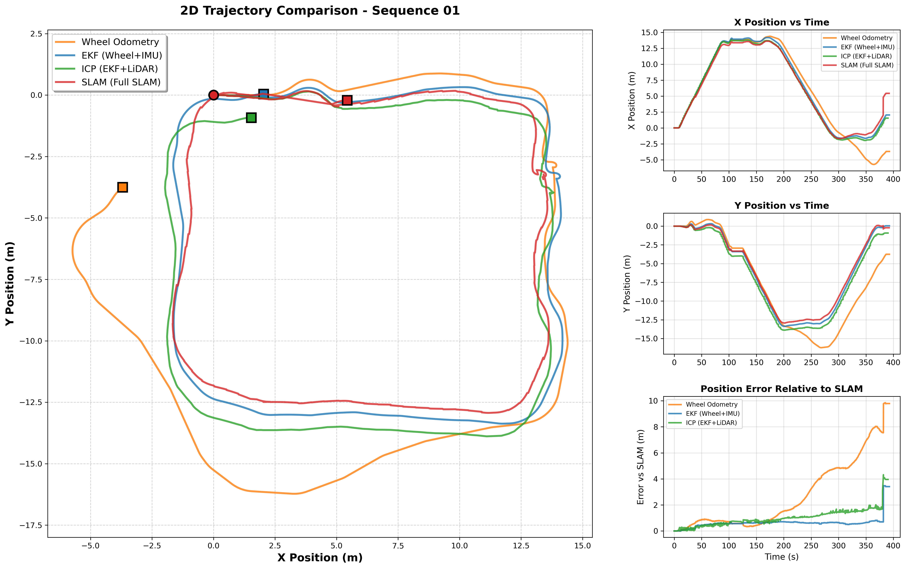

Sharp turns expose the weakness of wheel odometry, which accumulates large heading errors during fast rotations. The EKF excels here because the IMU gyroscope provides accurate angular velocity measurements that correct the heading during turns. ICP also performs well, as the obstacles provide distinctive scan features for matching.

### Sequence 02 (Smooth Motion)

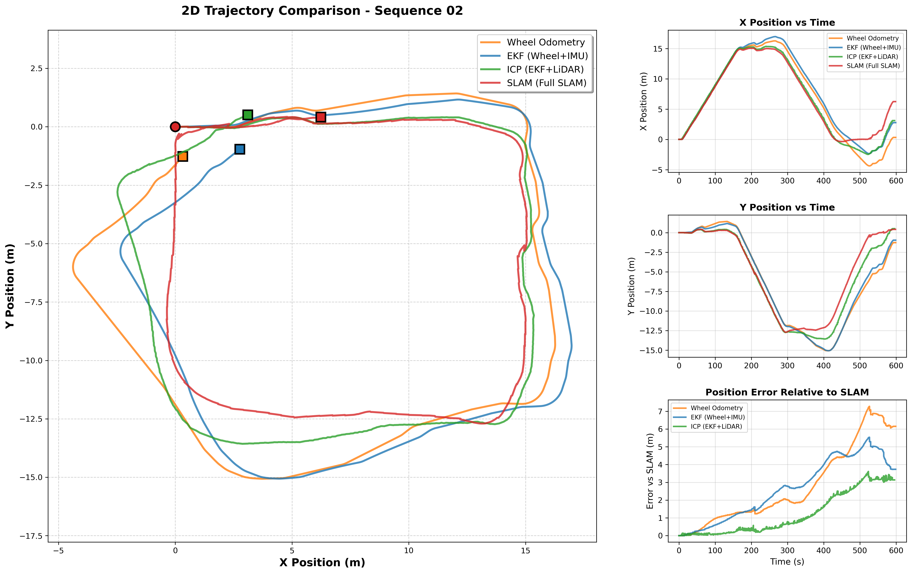

With smoother motion over a longer trajectory, drift accumulates gradually for all methods. Wheel odometry shows the worst heading drift (47.8 deg), while EKF also accumulates significant heading error (37.6 deg) in this sequence. ICP maintains better accuracy than both but shows more error than in the other sequences. This suggests that even with scan matching, long trajectories without loop closure will eventually drift.

### Heading Drift (Start vs End Orientation)

| Method | Seq 00 | Seq 01 | Seq 02 |
|--------|--------|--------|--------|
| Wheel  | 37.9 deg  | 36.8 deg  | 47.8 deg  |
| EKF    | 34.2 deg  | 0.4 deg   | 37.6 deg  |
| ICP    | 5.7 deg   | 2.2 deg   | 25.9 deg  |
| SLAM   | 7.4 deg   | 2.4 deg   | 6.4 deg   |

- Wheel odometry consistently accumulates the largest heading drift (36-48 deg) across all sequences.
- EKF dramatically reduces heading drift in Seq 01 (0.4 deg) where sharp turns make IMU corrections most effective, but provides less improvement in the other sequences.
- ICP keeps heading drift low in Seq 00 and 01 but shows higher drift in Seq 02 (25.9 deg), suggesting that longer trajectories can still cause drift even with scan matching.
- SLAM maintains low heading drift in all sequences (2-7 deg) thanks to loop closure and global optimization.

---

## Robustness

| Method | Strengths | Weaknesses |
|--------|-----------|------------|
| Wheel Odometry | Smooth output, no external sensor dependency, always available | Accumulates drift continuously, sensitive to wheel slip, no heading correction |
| EKF (Wheel+IMU) | Reduced heading drift via IMU fusion, online gyro bias estimation, works in any environment | Still open-loop (no external position correction), translational drift unchanged |
| ICP (EKF+LiDAR) | LiDAR-based position and heading correction, reduces both translational and rotational drift | Can struggle in featureless environments, sensitive to scan quality, no global correction |
| SLAM (slam_toolbox) | Loop closure corrects accumulated drift, globally consistent map and trajectory | Requires sufficient features for loop closure detection, higher computational cost |

### Map Quality Comparison

**ICP Maps:**
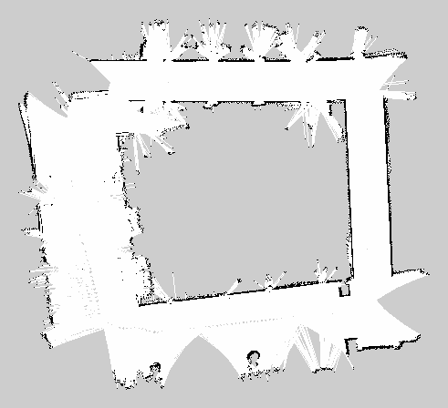
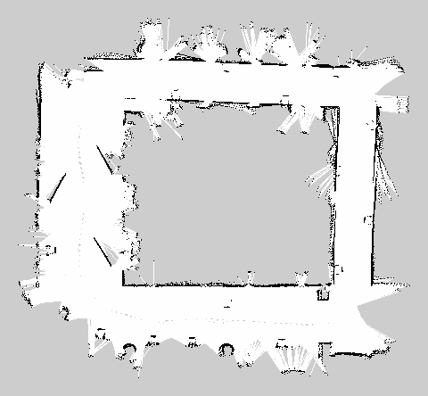
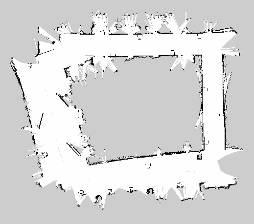

**SLAM Maps:**
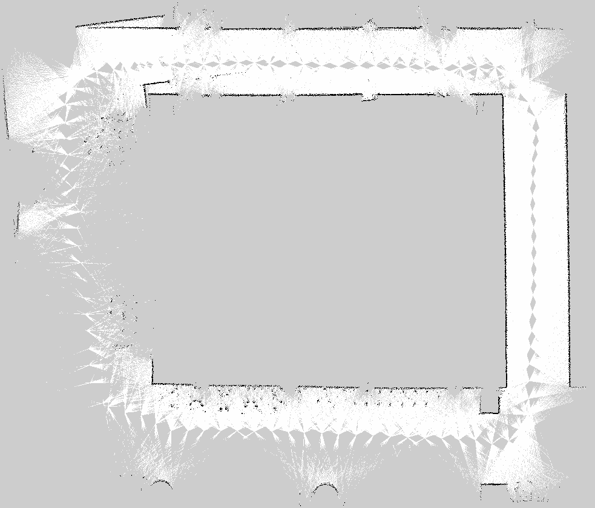
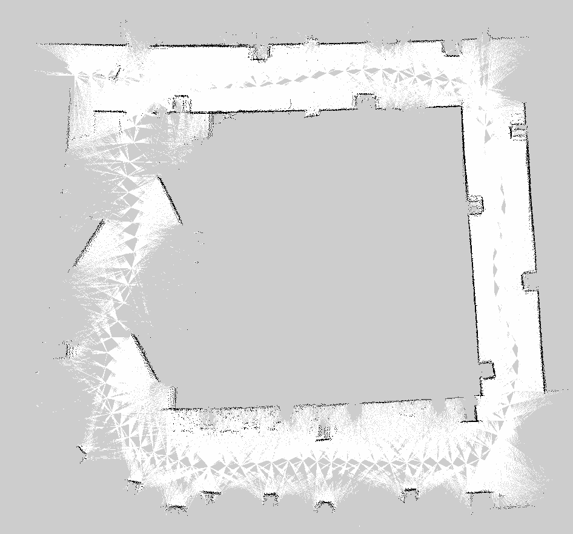
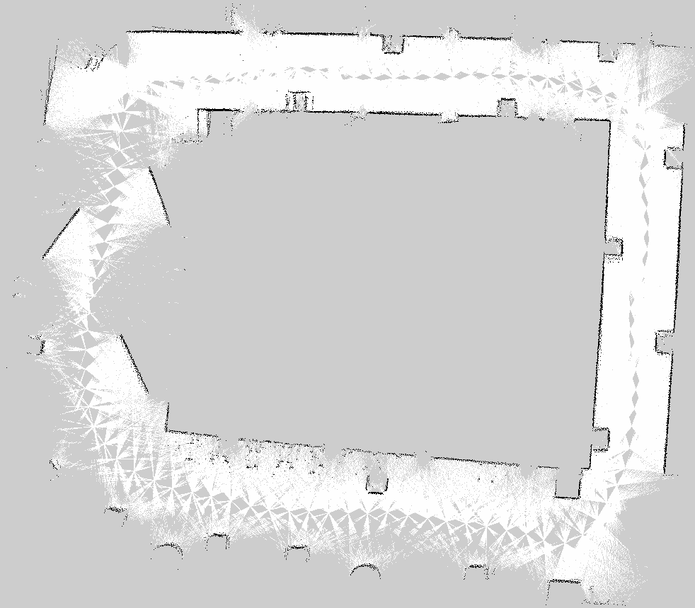

### Robustness Across Environments

- **Empty hallway (Seq 00):** All methods work reasonably well. ICP benefits from the hallway walls providing consistent scan features. The lack of obstacles means fewer distinctive landmarks for loop closure.

- **Sharp turns with obstacles (Seq 01):** The EKF shows its greatest advantage here, with IMU corrections preventing heading error during rapid rotations. ICP also benefits from the rich scan features provided by obstacles.

- **Smooth motion with obstacles (Seq 02):** The longer trajectory tests drift accumulation. Only SLAM with loop closure maintains consistently low heading drift. This demonstrates the fundamental limitation of open-loop methods: without global correction, even sensor fusion and scan matching eventually drift.

---

## Trajectory Length Comparison

| Method | Seq 00 (m) | Seq 01 (m) | Seq 02 (m) |
|--------|-----------|-----------|-----------|
| Wheel  | 55.940    | 56.420    | 59.370    |
| EKF    | 55.310    | 56.220    | 59.490    |
| ICP    | 56.430    | 57.690    | 60.300    |
| SLAM   | 57.560    | 60.430    | 62.110    |

SLAM consistently reports the longest trajectory, which likely reflects a more accurate path estimate that captures the true distance traveled. Methods with drift (especially heading drift) can either over- or under-estimate distance depending on how errors accumulate.

---

## Summary

Each method in the pipeline progressively improves localization:

1. **Wheel odometry** provides a baseline but drifts significantly (2.7-3.6m mean error vs SLAM).
2. **EKF fusion** reduces heading drift using IMU data, particularly effective during sharp turns (0.64m error in Seq 01), but cannot correct translational drift.
3. **ICP scan matching** provides the most consistent improvement (around 1.0m error across all sequences) by using LiDAR data to correct both position and heading.
4. **SLAM** with loop closure achieves the best overall accuracy by globally optimizing the trajectory, at the cost of higher computational requirements.

The key takeaway is that each additional sensor modality addresses a specific limitation: IMU corrects heading during fast rotations, LiDAR corrects position against the environment, and loop closure prevents long-term drift accumulation.
